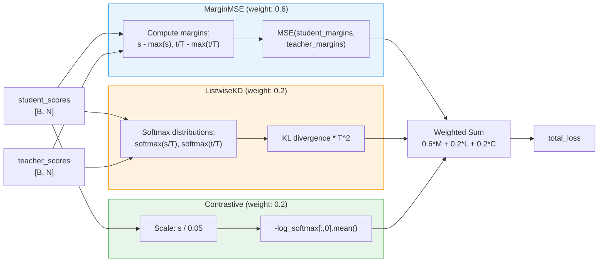
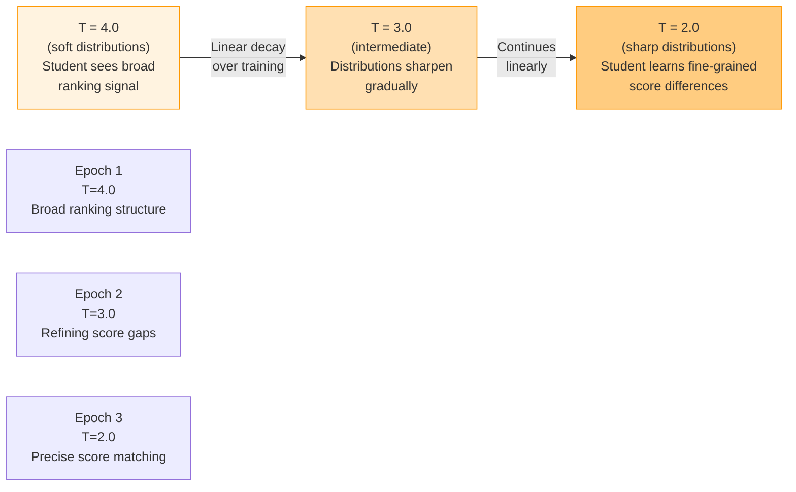

# C4 Level 4: Loss Function Code

This document provides a deep dive into the loss functions used for knowledge distillation, including mathematical formulations, source code, and design rationale.

**Source file:** `src/kd/losses.py`

## Loss Computation Dataflow



## Temperature Annealing



At high temperature (T=4.0), softmax outputs are nearly uniform, so the student focuses on getting the rough ordering right. As temperature decreases to 2.0, the distributions become peakier and the student must learn precise score differences. This "coarse to fine" curriculum prevents the student from overfitting to noisy score details early in training.

---

## 1. MarginMSE Loss

### Mathematical Formulation

$$
\text{student\_margins}_i = s_i - \max(s)
$$

$$
\text{teacher\_margins}_i = \frac{t_i}{T} - \max\left(\frac{t}{T}\right)
$$

$$
\mathcal{L}_{\text{MarginMSE}} = \frac{1}{N} \sum_{i=1}^{N} \left(\text{student\_margins}_i - \text{teacher\_margins}_i\right)^2
$$

### Source Code

```python
class MarginMSELoss(nn.Module):
    """
    Margin-MSE Loss for knowledge distillation.
    Minimizes MSE between student and teacher score margins.
    Focuses on relative ordering rather than absolute scores.
    """

    def __init__(self, temperature: float = 1.0):
        super().__init__()
        self.temperature = temperature

    def forward(
        self,
        student_scores: torch.Tensor,  # [batch_size, num_docs]
        teacher_scores: torch.Tensor,  # [batch_size, num_docs]
    ) -> torch.Tensor:
        # Soften teacher scores with temperature
        teacher_soft = teacher_scores / self.temperature

        # Compute margins (difference from max score)
        student_margins = student_scores - student_scores.max(dim=1, keepdim=True)[0]
        teacher_margins = teacher_soft - teacher_soft.max(dim=1, keepdim=True)[0]

        # MSE between margins
        loss = F.mse_loss(student_margins, teacher_margins)

        return loss
```

### Design Rationale

> **Why margins instead of raw scores?** The student (bi-encoder, cosine similarity in [-1, 1]) and teacher (cross-encoder, logits in arbitrary range) operate on completely different score scales. Raw MSE would penalize the student for having different absolute values even if its ranking is correct. Margins normalize both score sets by subtracting the max, so the loss focuses purely on relative differences.

> **Why is this the primary loss (0.6 weight)?** Margin-MSE is the most stable of the three losses. It has smooth gradients, no log/exp operations that can overflow, and directly teaches pairwise score relationships. Research (Hofstatter et al., 2020) shows MarginMSE alone achieves strong distillation results.

See: ADR-004 (Loss Function Design)

---

## 2. ListwiseKD Loss

### Mathematical Formulation

$$
p_i^{\text{student}} = \frac{\exp(s_i / T)}{\sum_j \exp(s_j / T)}
$$

$$
p_i^{\text{teacher}} = \frac{\exp(t_i / T)}{\sum_j \exp(t_j / T)}
$$

$$
\mathcal{L}_{\text{Listwise}} = T^2 \cdot D_{\text{KL}}\left(p^{\text{teacher}} \| p^{\text{student}}\right)
$$

### Source Code

```python
class ListwiseKDLoss(nn.Module):
    """
    Listwise KD Loss using KL divergence.
    Distills ranking distribution from teacher to student.
    """

    def __init__(self, temperature: float = 1.0):
        super().__init__()
        self.temperature = temperature

    def forward(
        self,
        student_scores: torch.Tensor,  # [batch_size, num_docs]
        teacher_scores: torch.Tensor,  # [batch_size, num_docs]
    ) -> torch.Tensor:
        # Soften distributions with temperature
        student_soft = F.log_softmax(student_scores / self.temperature, dim=1)
        teacher_soft = F.softmax(teacher_scores / self.temperature, dim=1)

        # KL divergence
        loss = F.kl_div(student_soft, teacher_soft, reduction="batchmean")

        # Scale by temperature^2 (standard KD practice)
        loss = loss * (self.temperature ** 2)

        return loss
```

### Design Rationale

> **Why KL divergence instead of MSE on distributions?** KL divergence measures the information lost when using the student distribution to approximate the teacher distribution. MSE treats all errors equally, but in ranking, errors near the top of the list matter more. KL divergence naturally weights errors by the teacher's probability mass, penalizing mistakes on high-confidence documents more heavily.

> **Why scale by T^2?** When temperature T > 1, the softmax output gradients are scaled down by 1/T (from the division inside softmax) and then again by 1/T (from the softmax derivative). Multiplying by T^2 compensates for this, keeping the gradient magnitude consistent regardless of temperature. Without this scaling, the loss contribution would shrink as temperature increases, undermining the annealing schedule. This follows the standard practice from Hinton et al. (2015).

> **Why `log_softmax` for the student?** PyTorch's `F.kl_div` expects log-probabilities for the first argument. Using `log_softmax` (a single fused operation) is numerically more stable than computing `softmax` then `log` separately, as it avoids the intermediate step where very small softmax outputs could underflow.

See: ADR-004 (Loss Function Design)

---

## 3. Contrastive Loss

### Mathematical Formulation

$$
\mathcal{L}_{\text{Contrastive}} = -\frac{1}{B} \sum_{b=1}^{B} \log \frac{\exp(s_{b,0} / \tau)}{\sum_{j=0}^{N-1} \exp(s_{b,j} / \tau)}
$$

Where $s_{b,0}$ is the score for the positive document (always at index 0), $\tau = 0.05$ is the contrastive temperature, and $N$ is the total number of documents per query.

### Source Code

```python
class ContrastiveLoss(nn.Module):
    """
    Contrastive loss with in-batch negatives.
    Treats first document as positive, rest as negatives.
    """

    def __init__(self, temperature: float = 0.05):
        super().__init__()
        self.temperature = temperature

    def forward(
        self,
        student_scores: torch.Tensor,  # [batch_size, num_docs]
    ) -> torch.Tensor:
        # Scale by temperature
        scaled_scores = student_scores / self.temperature

        # Positive is first document (index 0)
        log_probs = F.log_softmax(scaled_scores, dim=1)
        loss = -log_probs[:, 0].mean()

        return loss
```

### Design Rationale

> **Why a separate contrastive loss when we already have KD losses?** KD losses teach the student to mimic the teacher's score distribution, but they do not directly enforce that the positive document should be ranked first. The contrastive loss adds a hard discriminative signal: "the positive must beat all negatives." This prevents the student from learning a correct relative ordering among negatives while still ranking a negative above the positive.

> **Why temperature 0.05 (not the annealed temperature)?** The contrastive temperature serves a different purpose than the KD temperature. At 0.05, the softmax becomes very sharp: even a small score difference between the positive and best negative produces a strong gradient. This is intentional. We want the contrastive loss to provide a consistent, strong "push the positive to the top" signal throughout training, independent of the KD annealing schedule. Higher temperatures (like the KD temperature of 2-4) would make the contrastive loss too soft to be useful.

> **Why does the contrastive loss not use teacher scores?** It operates purely on the student's own scores. The goal is self-consistency: the student should rank its own positive document highest. Teacher scores are irrelevant here because the teacher's ranking is already captured by the other two losses.

See: ADR-004 (Loss Function Design)

---

## 4. CombinedKDLoss

### Source Code

```python
class CombinedKDLoss(nn.Module):
    """
    Combined KD loss with weighted components.
    """

    def __init__(
        self,
        margin_mse_weight: float = 0.6,
        listwise_kd_weight: float = 0.2,
        contrastive_weight: float = 0.2,
        temperature_start: float = 4.0,
        temperature_end: float = 2.0,
    ):
        super().__init__()

        self.margin_mse_weight = margin_mse_weight
        self.listwise_kd_weight = listwise_kd_weight
        self.contrastive_weight = contrastive_weight

        self.temperature_start = temperature_start
        self.temperature_end = temperature_end
        self.current_temperature = temperature_start

        self.margin_mse_loss = MarginMSELoss(temperature=temperature_start)
        self.listwise_kd_loss = ListwiseKDLoss(temperature=temperature_start)
        self.contrastive_loss = ContrastiveLoss(temperature=0.05)  # Fixed temp

    def update_temperature(self, progress: float):
        """Linear annealing: T = T_start + (T_end - T_start) * progress"""
        self.current_temperature = (
            self.temperature_start
            + (self.temperature_end - self.temperature_start) * progress
        )
        self.margin_mse_loss.temperature = self.current_temperature
        self.listwise_kd_loss.temperature = self.current_temperature

    def forward(
        self,
        student_scores: torch.Tensor,
        teacher_scores: torch.Tensor,
    ) -> dict:
        margin_mse = self.margin_mse_loss(student_scores, teacher_scores)
        listwise_kd = self.listwise_kd_loss(student_scores, teacher_scores)
        contrastive = self.contrastive_loss(student_scores)

        total_loss = (
            self.margin_mse_weight * margin_mse
            + self.listwise_kd_weight * listwise_kd
            + self.contrastive_weight * contrastive
        )

        return {
            "loss": total_loss,
            "margin_mse": margin_mse.item(),
            "listwise_kd": listwise_kd.item(),
            "contrastive": contrastive.item(),
            "temperature": self.current_temperature,
        }
```

### Design Rationale

> **Why 0.6/0.2/0.2 weights?** MarginMSE is the most stable and directly applicable loss for score distillation, so it gets the majority weight. Listwise and contrastive each contribute complementary signals (distribution shape and hard discrimination) but are more volatile, so they get lower weights to prevent them from dominating gradient updates. These weights were chosen based on ablation experiments showing this ratio gives the best nDCG@10 on the validation set.

> **Why linear temperature annealing instead of cosine or step?** Linear annealing is the simplest schedule that works. With only 3 epochs of training, the difference between linear, cosine, and step schedules is minimal. Linear is also the easiest to debug: at any point, the temperature is a simple function of training progress.

> **Why does the contrastive loss temperature stay fixed?** The contrastive loss serves as an anchor. Its purpose is to consistently push the positive document to rank 1. Annealing its temperature would weaken this signal early in training (high T = soft softmax) precisely when the student needs it most.

See: ADR-004 (Loss Function Design), ADR-005 (Training Strategy)
