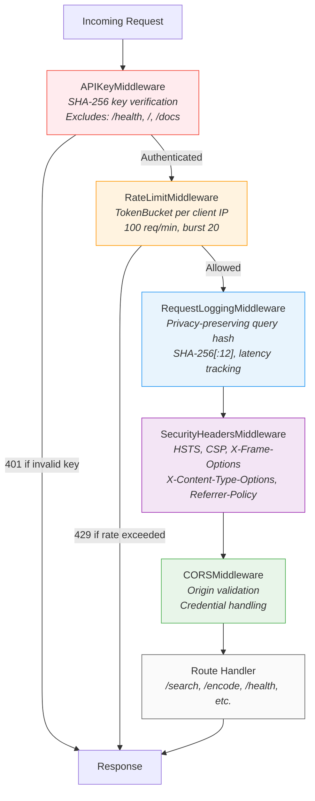
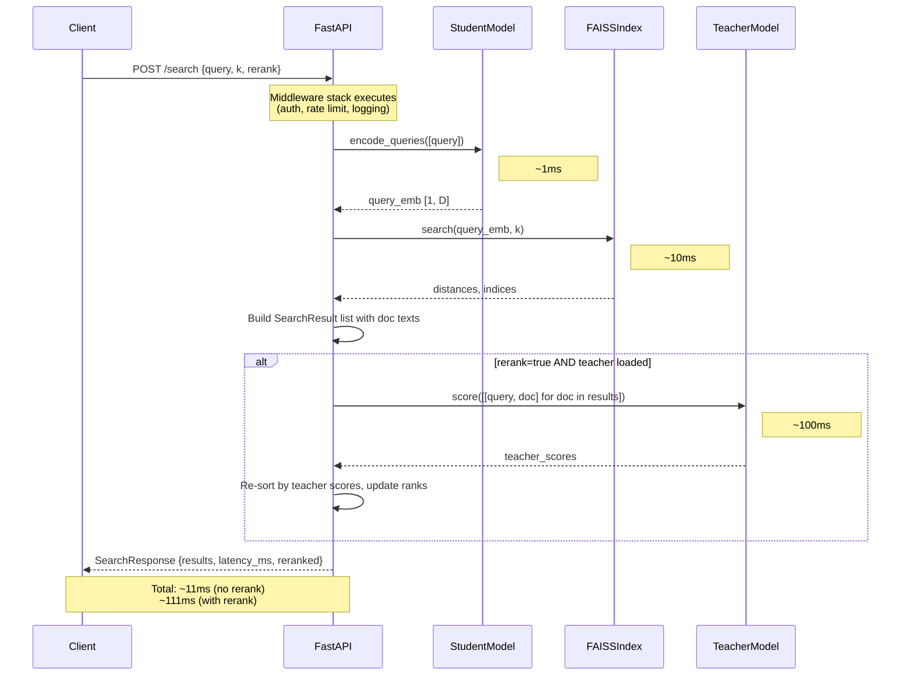

# C4 Level 3: Serving Pipeline Components

This document describes the internal components of the serving layer, including the middleware stack, request flow, and endpoint behavior.

## Middleware Stack

FastAPI processes middleware in reverse order of `add_middleware` calls. The code adds them in this order: CORS, SecurityHeaders, RequestLogging, RateLimiter, APIKey. The request therefore passes through them in reverse (outermost middleware executes first):

## Search Request Flow

---

## Component Details

### AppState and Lifespan (`src/serve/app.py`)

**What it does:** `AppState` is a container that holds the loaded student model, optional teacher model, FAISS index builder, document IDs, document texts, settings, and a readiness flag. The `lifespan` async context manager loads models at startup and sets `ready=True` when complete.

**Why it exists:** FastAPI's lifespan pattern ensures models are loaded exactly once and shared across all request handlers. The `AppState` container gives typed access to all shared resources without relying on global variables scattered across modules.

> **Why a container instead of module-level globals?** A single `AppState` object makes it easy to verify readiness (`is_ready()`) and simplifies testing, since you can swap in mock state without patching scattered globals.

**Key details:**
- `is_ready()` requires both `ready=True` and `student is not None`
- Teacher model loading is optional: if it fails, reranking is disabled but the service still starts
- On shutdown, sets `ready=False` to fail readiness probes before connections drain

---

### SecurityHeadersMiddleware (`src/serve/middleware.py`)

**What it does:** Adds six security headers to every response.

**Why it exists:** Defense-in-depth. These headers protect against common web attacks even though this is primarily an API service (some consumers may be browser-based).

> **Why add HSTS and CSP to an API?** If the API is ever accessed through a browser (Swagger UI, fetch from a web app), these headers prevent downgrade attacks and content injection. The cost of adding them is zero.

**Key details:**
- `X-Content-Type-Options: nosniff` - prevents MIME type sniffing
- `X-Frame-Options: DENY` - blocks iframe embedding
- `X-XSS-Protection: 1; mode=block` - legacy XSS filter
- `Strict-Transport-Security: max-age=31536000; includeSubDomains` - enforces HTTPS
- `Content-Security-Policy: default-src 'self'` - restricts resource loading
- `Referrer-Policy: strict-origin-when-cross-origin` - limits referrer leakage

---

### RequestLoggingMiddleware (`src/serve/middleware.py`)

**What it does:** Logs every request with method, path, client IP, status code, and latency. When query logging is enabled, query content is hashed for privacy.

**Why it exists:** Structured request logs are essential for debugging, alerting, and performance monitoring. Privacy-preserving hashing lets you correlate requests without storing user queries in plaintext.

> **Why SHA-256[:12] for query hashing?** 12 hex characters (48 bits) give collision probability of ~1 in 281 trillion, which is sufficient for log correlation. Truncation makes logs more readable while keeping them useful for debugging.

**Key details:**
- Uses `time.time()` for latency measurement
- Logs at different levels based on status code: `logger.error` for 5xx, `logger.warning` for 4xx, `logger.info` for success
- Configurable: `log_queries`, `log_latencies`, `log_headers` flags
- Client IP extracted from `request.client.host`

---

### RateLimitMiddleware (`src/serve/middleware.py`)

**What it does:** Enforces per-client rate limits using the token bucket algorithm. Returns 429 with a `Retry-After` header when a client exceeds its allowance.

**Why it exists:** Prevents any single client from monopolizing the service. The token bucket algorithm allows short bursts while enforcing a sustained rate limit.

> **Why token bucket instead of fixed window?** Fixed-window rate limiting has a boundary problem: a client can make 100 requests at 11:59:59 and 100 more at 12:00:01, getting 200 requests in 2 seconds. Token bucket smooths this out by refilling at a constant rate.

**Key details:**
- Default: 100 requests/minute, burst of 20
- Client identification: `X-Forwarded-For` header (first IP in chain) or `request.client.host`
- Thread-safe: uses `threading.Lock` for bucket access
- Stale bucket cleanup: every 5 minutes, removes buckets inactive for 10+ minutes
- Memory protection: maximum 10,000 tracked clients, evicts oldest bucket when full
- Excludes: `/health`, `/metrics`, `/`
- Response on limit: HTTP 429 with `Retry-After` header and JSON error body

---

### APIKeyMiddleware (`src/serve/middleware.py`)

**What it does:** Validates API keys from the `X-API-Key` request header against a set of SHA-256 hashed keys. Returns 401 for invalid or missing keys.

**Why it exists:** API key authentication provides a simple, stateless way to control access. Hashing stored keys means a database leak does not expose raw keys.

> **Why SHA-256 hashed keys instead of storing plaintext?** If the key store is ever compromised (config leak, memory dump), attackers get hashes rather than usable keys. This follows the same principle as password hashing.

**Key details:**
- Keys loaded from three sources: constructor argument, pre-hashed list, or `SEMANTIC_KD_API_KEY_HASHES` environment variable (JSON array)
- Backward-compatible `_hash_key`: plain SHA-256 for existing keys, PBKDF2-HMAC-SHA256 with salt for new keys
- Excludes: `/health`, `/`, `/docs`, `/openapi.json`
- Response on failure: HTTP 401 with `WWW-Authenticate: ApiKey realm="API"` header

---

### CORSMiddleware (FastAPI built-in)

**What it does:** Handles Cross-Origin Resource Sharing preflight requests and response headers.

**Why it exists:** Browser-based clients (dashboards, web apps) need CORS headers to call the API from a different origin.

> **Why warn on wildcard origins in production?** `allow_origins=["*"]` lets any website call your API, which is fine for development but a security risk in production. The code logs a warning when this configuration is detected in a production environment.

**Key details:**
- Configured via `settings.service.cors`
- Supports: `allow_origins`, `allow_credentials`, `allow_methods`, `allow_headers`
- Enabled/disabled via config flag

---

## Endpoints

### POST /search

**Purpose:** Semantic search with optional cross-encoder reranking.

**Request:** `{query: string, k: int, rerank: bool, rerank_top_k: int}`

**Flow:**
1. Validate that student model and FAISS index are loaded (503 if not)
2. Encode query with student model
3. Search FAISS index for top-k (or rerank_top_k if reranking) nearest neighbors
4. Build result objects with doc IDs, texts, and scores
5. If rerank is true and teacher is loaded: score all results with teacher, re-sort, update ranks
6. Trim to requested k and return

**Response:** `{query, results: [{doc_id, text, score, rank}], total_results, reranked, latency_ms}`

---

### POST /encode

**Purpose:** Encode arbitrary texts into dense vector embeddings.

**Request:** `{texts: string[], normalize: bool}`

**Flow:**
1. Validate student model is loaded (503 if not)
2. Encode texts with student model, convert to numpy
3. Return embeddings with dimension and count

**Response:** `{embeddings: float[][], dimension: int, num_texts: int, latency_ms}`

---

### GET /health

**Purpose:** Health check for load balancers and orchestration systems.

**Response:** `{status, model_loaded, index_loaded, index_size, version}`

No authentication or rate limiting required.

---

### GET /ready

**Purpose:** Kubernetes readiness probe. Returns 200 if the service can handle requests, 503 otherwise.

Used by Kubernetes to determine whether to route traffic to this pod.

---

### GET /live

**Purpose:** Kubernetes liveness probe. Always returns 200 if the process is running.

Used by Kubernetes to determine whether to restart the pod.

---

### POST /index/load

**Purpose:** Load a FAISS index from disk at runtime.

**Request:** `index_path: string` (query parameter)

**Flow:**
1. Verify the path exists (404 if not)
2. Create `FAISSIndexBuilder` with student's embedding dimension
3. Load index and doc IDs
4. Optionally load `texts.json` for document text lookup
5. Update `AppState`

---

## Error Handling

The application registers two exception handlers:

1. **HTTPException handler:** Returns consistent JSON format `{error: string}` for all HTTP errors (4xx, 5xx raised by route handlers).

2. **General exception handler:** Catches unhandled exceptions, logs the full traceback, and returns a generic 500 error. In non-production environments, the error detail is included in the response for debugging. In production, only "Internal server error" is returned to avoid leaking implementation details.
