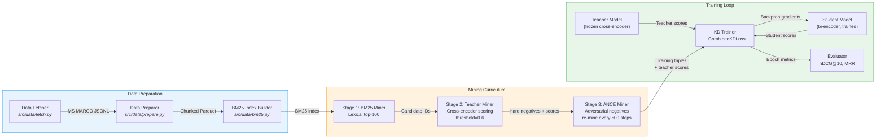
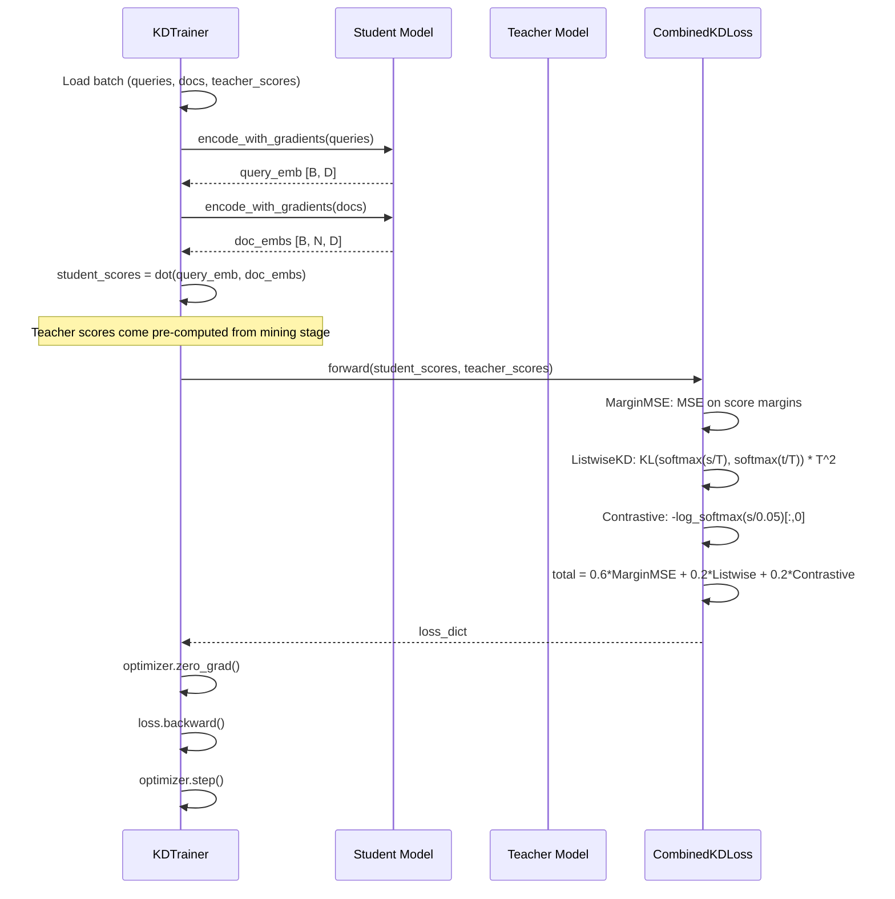

# C4 Level 3: Training Pipeline Components

This document describes the internal components of the training pipeline, how data flows between them, and why each component exists.

## Component Diagram

## Training Step Sequence

---

## Component Details

### Data Fetcher (`src/data/fetch.py`)

**What it does:** Downloads the MS MARCO Passage Ranking dataset from HuggingFace Hub and saves each split (train, validation, test) as JSONL files.

**Why it exists:** Raw data acquisition is separated from transformation so that fetching happens once, and re-preparation does not require re-downloading.

> **Why?** HuggingFace's `datasets` library handles versioning, caching, and streaming. Saving to JSONL gives us a portable, human-readable intermediate format that is not tied to any specific library.

**Key details:**
- Uses `load_dataset("ms_marco", "v2.1")`
- Saves per-split JSONL files
- Writes a manifest JSON with file paths and sample counts
- Supports `max_samples` parameter for development/testing

---

### Data Preparer (`src/data/prepare.py`)

**What it does:** Reads raw JSONL, chunks passage text using `TextChunker`, and writes the results as Parquet files with Snappy compression.

**Why it exists:** Search operates on chunks, not full documents. Chunking at preparation time means the training pipeline and index builder both work with pre-chunked data.

> **Why Parquet?** Columnar storage with Snappy compression gives fast reads, small file size, and compatibility with pandas, PyArrow, and DuckDB. JSONL would be 3-5x larger on disk.

**Key details:**
- `TextChunker`: 512 tokens max, stride of 80 tokens for overlap
- Handles both MS MARCO v2.1 nested passage format and older list format
- Each chunk record includes: `chunk_id`, `doc_id`, `query_id`, `query_text`, `text`, `tokens`, `is_relevant`, `split`, `updated_at`

---

### BM25 Index Builder (`src/data/bm25.py`)

**What it does:** Builds a BM25Okapi index over the chunked corpus and persists it as JSON files.

**Why it exists:** BM25 provides the initial candidate pool for hard negative mining (Stage 1). Lexical retrieval is fast and requires no GPU.

> **Why JSON instead of pickle?** Pickle deserialization can execute arbitrary code, making it a security risk. JSON serialization is safe and human-inspectable. The index also writes a SHA-256 checksum for integrity verification on load.

**Key details:**
- Uses `rank_bm25.BM25Okapi`
- Saves: `doc_ids.json`, `tokenized_corpus.json`, `bm25_params.json`, `checksum.json`
- Tokenization: lowercased whitespace split
- Integrity check on load via SHA-256 checksum comparison

See: ADR-003 (Data Pipeline Design)

---

### Stage 1: BM25 Miner (`src/mining/miners.py` - `BM25Miner`)

**What it does:** Retrieves the top-100 BM25 results for each query, excluding known positives, to produce an initial set of hard negatives.

**Why it exists:** BM25 negatives are "lexically tricky" - they share vocabulary with the query but are not semantically relevant. This teaches the student that keyword overlap alone does not indicate relevance.

> **Why top-100?** Retrieving 100 candidates provides a large enough pool for the teacher to filter down to the hardest negatives. Going higher adds mostly easy negatives that contribute little to training signal.

**Key details:**
- Loads a pre-built `BM25Index`
- Excludes positive doc IDs from results
- Returns `List[List[str]]` of negative doc IDs per query

---

### Stage 2: Teacher Miner (`src/mining/miners.py` - `TeacherMiner`)

**What it does:** Takes BM25 candidates and scores each (query, candidate) pair with the cross-encoder teacher. Keeps the top-k candidates above a confidence threshold of 0.6.

**Why it exists:** The teacher identifies semantically hard negatives: documents that a strong model recognizes as somewhat relevant but not the best answer. These are the most informative training examples.

> **Why confidence threshold 0.6?** Below 0.6, the teacher itself is uncertain whether the document is relevant. Training on uncertain examples introduces noise. Above 0.6, the teacher is confident the document is "close but wrong," which is exactly the distinction we want the student to learn.

**Key details:**
- Scores with `teacher.score()` in batches of 32
- Sorts by score descending, takes top-k (default 10)
- Filters by `teacher.get_confidence(score) >= 0.6`
- Returns both negative IDs and their teacher scores (used as soft labels)

See: ADR-004 (Loss Function Design)

---

### Stage 3: ANCE Miner (`src/mining/miners.py` - `ANCEMiner`)

**What it does:** Uses the current student model to find adversarial negatives that the student scores close to (within margin 0.1 of) the positive documents.

**Why it exists:** As the student improves, static negatives become too easy. ANCE re-mines negatives that specifically exploit the student's current weaknesses, creating a curriculum that adapts to the student's progress.

> **Why re-mine every 500 steps?** The student's embedding space shifts during training. Re-mining too frequently wastes compute on a model that has barely changed. Too infrequently, and the negatives go stale. 500 steps balances freshness with efficiency.

**Key details:**
- Encodes queries, positives, and candidates with the student
- Computes cosine similarity (embeddings are normalized)
- Selects candidates where `score >= max_pos_score - margin`
- Default margin: 0.1, default top-k: 5
- Combined with teacher negatives: top-5 teacher + top-5 ANCE

See: ADR-005 (Training Strategy)

---

### KDDataset (`src/kd/train.py`)

**What it does:** A PyTorch Dataset that packages queries, positive docs, negative docs, and teacher scores into training examples.

**Why it exists:** Decouples data loading from training logic. The dataset handles text lookup from doc IDs and constructs the [positive, negatives...] ordering that the loss functions expect.

**Key details:**
- `__getitem__` returns: query text, concatenated doc texts (positive first), doc IDs, teacher scores (1.0 for positives, actual scores for negatives)
- Custom `collate_fn` groups items into batch-level lists
- Corpus texts stored as `Dict[str, str]` for O(1) lookup by doc ID

---

### KDTrainer (`src/kd/train.py`)

**What it does:** Orchestrates the training loop: iterates epochs, computes losses, runs backpropagation, manages checkpoints, and implements early stopping.

**Why it exists:** Centralizes training logic with proper gradient management, temperature scheduling, and model persistence.

> **Why early stopping with patience=2?** Knowledge distillation converges quickly (3 epochs in our case). If loss does not improve for 2 consecutive epochs, the model is either overfitting or has plateaued. Stopping early saves compute and avoids degradation.

**Key details:**
- Per-epoch: calls `loss_fn.update_temperature(epoch/total_epochs)` for annealing
- Per-batch: encodes queries and docs with gradients, computes student scores via dot product, calls `CombinedKDLoss`
- Saves checkpoints per epoch (`checkpoint_epoch_N.pt` + `metrics_epoch_N.json`)
- Saves best model separately at `best_model/`
- Early stopping: tracks `best_loss` and `patience_counter`
- Student moved to device and set to `.train()` mode; teacher remains frozen

See: ADR-004 (Loss Function Design), ADR-005 (Training Strategy)

---

### CombinedKDLoss (`src/kd/losses.py`)

**What it does:** Computes the weighted sum of three loss functions (MarginMSE, ListwiseKD, Contrastive) and manages temperature annealing.

**Why it exists:** No single loss captures all aspects of knowledge distillation. The combination teaches the student about relative rankings (MarginMSE), full distribution shape (ListwiseKD), and hard discrimination (Contrastive).

**Key details:**
- Weights: 0.6 MarginMSE + 0.2 ListwiseKD + 0.2 Contrastive
- Temperature annealing: linear from 4.0 to 2.0 over training
- Returns a dict with total loss and component breakdowns
- See the [Loss Function Code](c4-code-losses.md) document for full mathematical detail

See: ADR-004 (Loss Function Design)
