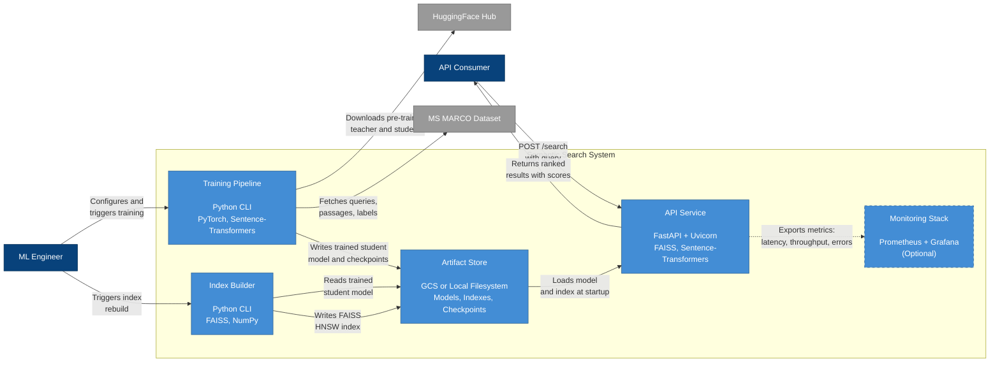

# C4 Level 2: Container Diagram

This document zooms into the Semantic Search System and describes its internal containers: the major deployable units, what each one does, and how data flows between them.

## Container Diagram



## Containers

### Training Pipeline

**What it does:** Orchestrates the full knowledge distillation workflow, from raw data to a trained student model. It fetches MS MARCO data, mines hard negatives in three stages (BM25, teacher-scored, ANCE), generates soft labels from the teacher cross-encoder, and trains the student bi-encoder to reproduce those labels.

**Why it exists as a separate container:** Training is a batch process that runs infrequently (once per model version) and has different resource requirements than serving. It needs GPU or high-CPU machines for hours, then shuts down. Separating it from the API service means training infrastructure does not affect serving availability.

**Technologies:**
- Python CLI entry point (`scripts/train_kd_pipeline.py`)
- PyTorch for model training
- Sentence-Transformers for model loading and encoding
- BM25 (rank-bm25) for lexical negative mining
- YAML configuration (`configs/kd.yaml`)

**Key artifacts produced:**
- Trained student model weights (`artifacts/models/kd_student_*/`)
- Training checkpoints for resumability
- Training metrics and logs

---

### Index Builder

**What it does:** Takes a trained student model and a document corpus, encodes every document into a dense vector, and builds a FAISS HNSW index for fast approximate nearest-neighbor search.

**Why it exists as a separate container:** Index building is a batch process that runs after training completes (or when the corpus changes). It is computationally intensive but short-lived. Separating it ensures the API service does not need to handle index construction, and allows index rebuilds without API downtime.

**Technologies:**
- Python CLI entry point (`scripts/build_index.py`)
- FAISS for HNSW index construction and serialization
- Sentence-Transformers for document encoding
- NumPy for vector manipulation
- YAML configuration (`configs/index.yaml`)

**Key artifacts produced:**
- FAISS HNSW index file (`artifacts/indexes/`)
- Document ID mapping (index position to document metadata)

---

### API Service

**What it does:** Serves real-time search queries. On startup, it loads the trained student model and FAISS index into memory. For each incoming query, it encodes the query with the student model (~1ms), searches the FAISS index for nearest neighbors (~10ms), and returns ranked results with scores.

**Why it exists as a separate container:** This is the only container that faces external traffic. It must be always-on (or scale-to-zero with fast cold starts), horizontally scalable, and optimized for low latency. Its lifecycle and scaling requirements are fundamentally different from the batch containers.

**Technologies:**
- FastAPI for the REST API framework
- Uvicorn as the ASGI server
- Sentence-Transformers for query encoding
- FAISS for nearest-neighbor search
- Middleware for request logging, latency tracking, and error handling
- YAML configuration (`configs/service.yaml`)
- Docker for containerization
- Deployed on GCP Cloud Run

**Key endpoints:**
- `POST /search` - Primary search endpoint
- `GET /health` - Health check for load balancers and Cloud Run

---

### Artifact Store

**What it does:** Provides durable storage for all artifacts that flow between containers: trained model weights, FAISS indexes, training checkpoints, and configuration snapshots.

**Why it exists as a separate container:** The training pipeline and API service run at different times and potentially on different machines. A shared artifact store decouples producers from consumers. The training pipeline writes a model; hours or days later, the API service reads it. Without a shared store, artifact transfer would require manual steps or brittle file-copying scripts.

**Technologies:**
- Google Cloud Storage (GCS) in production
- Local filesystem (`artifacts/`) in development
- Standard file formats: PyTorch model files, FAISS index binary, JSON metadata

**Storage layout:**
```
artifacts/
  models/
    kd_student_demo/          # Demo-trained model
    kd_student_production/    # Full-trained model
  indexes/
    hnsw_demo.index           # Demo FAISS index
    hnsw_production.index     # Production FAISS index
  checkpoints/                # Training checkpoints
```

---

### Monitoring Stack

**What it does:** Collects, stores, and visualizes operational metrics from the API service. Provides dashboards for query latency, throughput, error rates, and model inference times. Supports alerting for SLA violations.

**Why it exists:** Without monitoring, operational issues (latency spikes, error rate increases, memory leaks) are invisible until users complain. The monitoring stack closes this feedback loop.

**Why it is optional:** The search system functions correctly without monitoring. In development and demo scenarios, monitoring adds unnecessary complexity. In production, it is strongly recommended.

**Technologies:**
- Prometheus for metrics collection and storage
- Grafana for dashboards and alerting
- Prometheus client library in the API service for metric exposition

---

## Data Flow

The complete lifecycle from raw data to a served search query follows this path:

### Phase 1: Training

1. The ML engineer configures training parameters in `configs/kd.yaml` and triggers the training pipeline.
2. The training pipeline downloads pre-trained model weights from HuggingFace Hub (teacher: bge-reranker-large, student: e5-small-v2).
3. The training pipeline fetches the MS MARCO dataset (queries, passages, relevance labels).
4. **BM25 mining:** The pipeline indexes the corpus with BM25 and retrieves lexically similar negatives for each query.
5. **Teacher scoring:** The cross-encoder teacher scores all (query, candidate) pairs, producing soft relevance labels.
6. **ANCE mining:** The student encodes the corpus, retrieves its own nearest neighbors, and the teacher identifies which ones are false positives.
7. The student trains on the mined examples using the 3-component loss (Margin-MSE 60%, Listwise-KD 20%, Contrastive 20%) with temperature annealing from 4.0 to 2.0.
8. The trained student model is saved to the artifact store.

### Phase 2: Indexing

9. The ML engineer (or an automated pipeline) triggers the index builder.
10. The index builder loads the trained student model from the artifact store.
11. It encodes every document in the corpus into a dense vector using the student model.
12. It builds a FAISS HNSW index from these vectors, optimizing for recall-speed balance.
13. The index and document ID mapping are saved to the artifact store.

### Phase 3: Serving

14. The API service starts up and loads the student model and FAISS index from the artifact store into memory.
15. An API consumer sends a `POST /search` request with a query string and desired result count.
16. The API service encodes the query with the student model (~1ms).
17. It searches the FAISS HNSW index for the K nearest document vectors (~10ms).
18. It maps index positions back to document IDs and text, assembles the response with scores and ranks.
19. It returns the ranked results to the consumer.
20. Latency and throughput metrics are exported to Prometheus (if monitoring is enabled).

### Artifact Dependencies

```
Training Pipeline ──writes──> [Student Model] ──reads──> Index Builder
                                                          │
                                                          writes
                                                          v
                                                    [FAISS Index]
                                                          │
                                                          reads
                                                          v
                               [Student Model] ──reads──> API Service
```

Each arrow represents an artifact dependency mediated by the artifact store. No container communicates directly with another at runtime. This decoupling means any container can be updated, rerun, or scaled independently.
