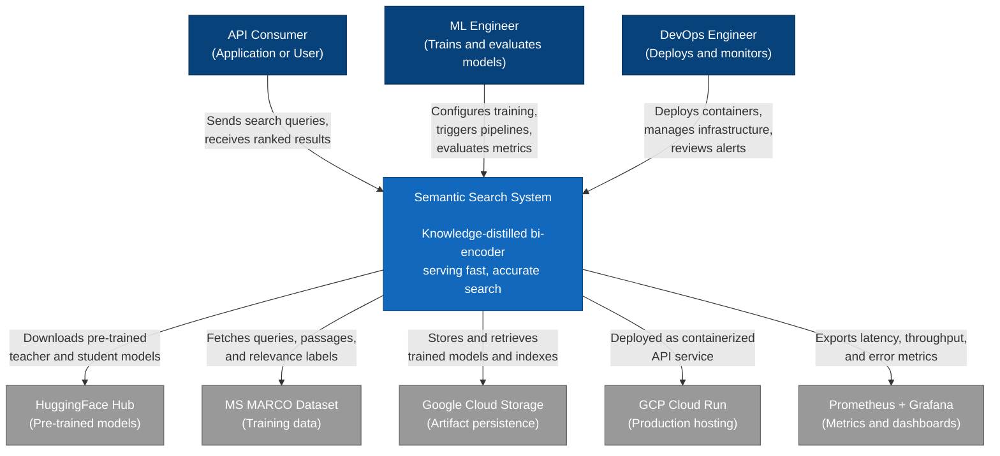

# C4 Level 1: System Context Diagram

This document describes the Semantic Search System at the highest level of abstraction: who interacts with it, what external systems it depends on, and where the system boundary sits.

## Context Diagram

## Relationships

### Actors

**API Consumer** represents any application or end user that sends search queries to the system and receives ranked document results. Consumers interact exclusively through the REST API. They send a query string and receive a ranked list of documents with relevance scores. The consumer does not need to know anything about the underlying model, index, or ranking strategy.

**ML Engineer** is responsible for the model lifecycle: configuring training hyperparameters, running the distillation pipeline, evaluating the student model against the teacher, and deciding when a new model version is ready for production. The ML engineer interacts with the system through CLI scripts and configuration files, not through the search API.

**DevOps Engineer** manages deployment, infrastructure, and operational health. This includes building Docker images, deploying to Cloud Run, configuring autoscaling, setting up monitoring dashboards, and responding to alerts. The DevOps engineer interacts with the system through infrastructure-as-code, CI/CD pipelines, and monitoring tools.

### External Systems

**HuggingFace Hub** provides the pre-trained model weights that serve as starting points. The training pipeline downloads the teacher model (BAAI/bge-reranker-large) and the student model (intfloat/e5-small-v2) from the Hub before distillation begins. This is a read-only dependency: the system consumes models but does not publish to the Hub.

**MS MARCO Dataset** supplies the training data: queries, passages, and human-annotated relevance judgments. The data pipeline fetches and preprocesses this dataset. MS MARCO was chosen because it is the standard benchmark for passage retrieval and provides enough volume for meaningful distillation training.

**Google Cloud Storage (GCS)** acts as the durable artifact store for trained models, FAISS indexes, and training checkpoints. Both the training pipeline (writing artifacts) and the API service (reading artifacts) interact with GCS. In local development, the local filesystem substitutes for GCS.

**GCP Cloud Run** hosts the production API service as a containerized application. Cloud Run provides automatic scaling (including scale-to-zero), HTTPS termination, and managed infrastructure. The system is packaged as a Docker image and deployed through Cloud Run's container registry.

**Prometheus + Grafana** form the optional monitoring stack. The API service exports metrics (query latency, throughput, error rates, model inference times) in Prometheus format. Grafana dashboards visualize these metrics and support alerting rules for operational monitoring.

## Boundaries

### Inside the System

Everything the team builds and maintains:

- **Training pipeline** that orchestrates data fetching, negative mining, teacher scoring, and student training
- **Index builder** that encodes the corpus with the trained student and builds a FAISS HNSW index
- **API service** that loads the model and index, accepts search queries, and returns ranked results
- **Configuration files** that define training hyperparameters, index parameters, and service settings
- **Docker packaging** and deployment scripts

### Outside the System

Dependencies the team consumes but does not control:

- Pre-trained model weights on HuggingFace Hub
- The MS MARCO dataset and its relevance judgments
- GCP infrastructure services (Cloud Run, Cloud Storage, Container Registry)
- Monitoring infrastructure (Prometheus, Grafana)
- The PyTorch, Sentence-Transformers, and FAISS libraries

### Key Boundary Decisions

The system does **not** include a document ingestion pipeline. It assumes documents are available in MS MARCO format or a compatible schema. A production deployment searching custom documents would need an ingestion layer outside this system's boundary.

The system does **not** include a user-facing search UI. The API service exposes a REST endpoint; any frontend is a separate concern owned by the API consumer.

The monitoring stack is **optional**. The system functions without it, but operational visibility in production depends on it being deployed.
