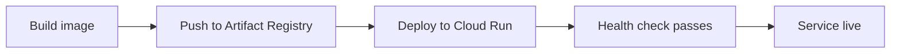

# Deployment Guide

## When you need this

You have a trained model and want to serve it as a production API. This guide covers local Docker testing, GCP Cloud Run deployment, model loading from GCS, and production hardening.

## Local Docker build and run

### Build the image

```bash
docker build -t semantic-kd:latest .
```

The Dockerfile uses a multi-stage build:

1. **Builder stage**: installs dependencies with Poetry in a virtual environment
2. **Runtime stage**: copies only the venv and application code into a slim Python 3.10 image, installs `gsutil` for GCS model downloads, and creates a non-root `appuser`

### Run with docker-compose

```bash
docker-compose up -d
```

This starts the API on port 8080 with local model artifacts mounted as read-only volumes:

```yaml
volumes:
  - ./artifacts/models:/app/artifacts/models:ro
  - ./artifacts/indexes:/app/artifacts/indexes:ro
  - ./data:/app/data:ro
```

Verify it is running:

```bash
curl http://localhost:8080/health
```

To also start Prometheus and Grafana for monitoring:

```bash
docker-compose --profile monitoring up -d
```

This adds Prometheus on port 9090 and Grafana on port 3000.

### Stop services

```bash
docker-compose down
```

## Environment variables for production

The service is configured through environment variables with the prefix `SEMANTIC_KD_`. Key variables:

| Variable | Default | Description |
|----------|---------|-------------|
| `SEMANTIC_KD_ENVIRONMENT` | `production` | Environment name (development, staging, production) |
| `SEMANTIC_KD_SERVICE__PORT` | `8080` | Service port |
| `SEMANTIC_KD_SERVICE__LOG_LEVEL` | `info` | Log level |
| `SEMANTIC_KD_SERVICE__AUTH__ENABLED` | `false` | Enable API key authentication |
| `SEMANTIC_KD_SERVICE__CORS__ALLOW_ORIGINS` | `["http://localhost:3000"]` | Allowed CORS origins |
| `SEMANTIC_KD_SERVICE__RATE_LIMIT__ENABLED` | `true` | Enable rate limiting |
| `SEMANTIC_KD_SERVICE__RATE_LIMIT__REQUESTS_PER_MINUTE` | `100` | Rate limit per minute |
| `GCS_MODEL_PATH` | (empty) | GCS path for model download at startup |

## GCP Cloud Run deployment



### Step 1: Build and push the image

```bash
export PROJECT_ID=your-gcp-project
export REGION=us-central1

# Configure Docker for Artifact Registry
gcloud auth configure-docker ${REGION}-docker.pkg.dev

# Build and tag
docker build -t ${REGION}-docker.pkg.dev/${PROJECT_ID}/semantic-kd/api:latest .

# Push
docker push ${REGION}-docker.pkg.dev/${PROJECT_ID}/semantic-kd/api:latest
```

Or use Cloud Build:

```bash
gcloud builds submit --config=infra/cloudbuild.yaml
```

### Step 2: Upload model to GCS

```bash
gsutil -m cp -r artifacts/models/kd_student_full gs://your-bucket/models/kd_student_full
gsutil -m cp -r artifacts/indexes gs://your-bucket/indexes
```

### Step 3: Deploy to Cloud Run

```bash
gcloud run deploy semantic-kd \
    --image ${REGION}-docker.pkg.dev/${PROJECT_ID}/semantic-kd/api:latest \
    --region ${REGION} \
    --platform managed \
    --memory 32Gi \
    --cpu 8 \
    --min-instances 0 \
    --max-instances 100 \
    --concurrency 80 \
    --timeout 300 \
    --port 8080 \
    --set-env-vars "GCS_MODEL_PATH=gs://your-bucket/models/kd_student_full,SEMANTIC_KD_ENVIRONMENT=production,SEMANTIC_KD_SERVICE__AUTH__ENABLED=true,SEMANTIC_KD_SERVICE__RATE_LIMIT__ENABLED=true" \
    --service-account ${SERVICE_ACCOUNT}
```

### Step 4: Verify deployment

```bash
SERVICE_URL=$(gcloud run services describe semantic-kd --region ${REGION} --format 'value(status.url)')
curl ${SERVICE_URL}/health
```

## Model loading from GCS

The Docker entrypoint script (`scripts/entrypoint.sh`) handles GCS model download at container startup. When you set the `GCS_MODEL_PATH` environment variable, the container:

1. Downloads the model from GCS using `gsutil`
2. Places it in `/app/artifacts/models/kd_student_production/`
3. Starts the uvicorn server

The health check has a 180-second start period (`--start-period=180s` in the Dockerfile) to allow time for model download before marking the container as unhealthy.

## Health checks and readiness probes

The service exposes health endpoints configured in `configs/service.yaml`:

```yaml
health:
  readiness_check: true
  liveness_check: true
  startup_probe_delay: 10
```

| Endpoint | Purpose | When it passes |
|----------|---------|---------------|
| `GET /health` | Liveness check | Service process is running |
| `GET /ready` | Readiness check | Model and index are loaded |

The Docker health check polls `/health` every 30 seconds with a 10-second timeout and 3 retries:

```dockerfile
HEALTHCHECK --interval=30s --timeout=10s --start-period=180s --retries=3 \
    CMD curl -f http://localhost:8080/health || exit 1
```

For Cloud Run, the platform handles health checks automatically. The `--timeout 300` flag gives the container 5 minutes to start serving.

## Scaling configuration

Settings from `configs/service.yaml` for Cloud Run:

```yaml
gcp:
  memory: "32Gi"
  cpu: "8"
  max_instances: 100
  min_instances: 0
  concurrency: 80
  timeout: 300
```

| Parameter | Value | Rationale |
|-----------|-------|-----------|
| Memory | 32 Gi | FAISS index and model weights are loaded in memory |
| CPU | 8 | Embedding computation is CPU-bound when no GPU is available |
| Min instances | 0 | Scale to zero when idle to save cost |
| Max instances | 100 | Upper bound for traffic spikes |
| Concurrency | 80 | Requests per container instance |
| Timeout | 300s | Allows for model loading on cold start |

To avoid cold start latency, set `min_instances: 1` (or higher) so at least one warm instance is always running.

## Security checklist for production

Before going live, verify each item:

- [ ] **Authentication enabled**: set `SEMANTIC_KD_SERVICE__AUTH__ENABLED=true` and configure API keys in `secrets/api_keys.txt`
- [ ] **CORS restricted**: update `SEMANTIC_KD_SERVICE__CORS__ALLOW_ORIGINS` to only your frontend domains
- [ ] **Rate limiting active**: `SEMANTIC_KD_SERVICE__RATE_LIMIT__ENABLED=true` with appropriate `REQUESTS_PER_MINUTE`
- [ ] **Non-root user**: the Dockerfile runs as `appuser` (UID 1000), not root
- [ ] **Query logging disabled**: `monitoring.logging.log_queries: false` in `service.yaml` to avoid logging raw user queries (privacy)
- [ ] **GCS access scoped**: the service account should have only `storage.objectViewer` on the model bucket
- [ ] **Secrets not in image**: API keys and credentials are injected via environment variables or Secret Manager, never baked into the Docker image
- [ ] **HTTPS enforced**: Cloud Run provides HTTPS by default; if self-hosting, configure TLS termination at the load balancer
- [ ] **Image scanning**: scan the built image for vulnerabilities before pushing to production
