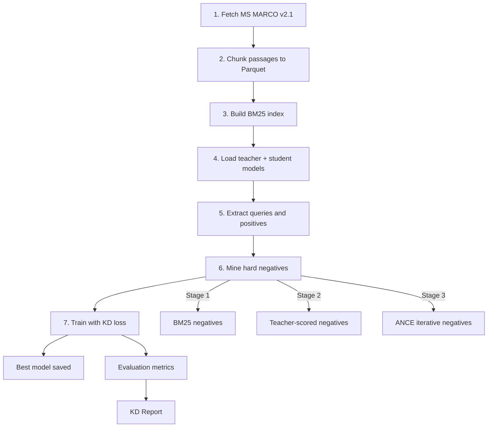

# Training Guide

## When you need this

You have run the quickstart demo and want to train a production-quality model. This guide covers the full 7-step pipeline, local vs. GCP training, configuration knobs, and how to monitor and evaluate your training runs.

## Pipeline overview

The training pipeline has seven sequential steps, each building on the previous one:

| Step | Name | What it does |
|------|------|-------------|
| 1/7 | Fetch data | Downloads MS MARCO v2.1 from HuggingFace |
| 2/7 | Prepare data | Chunks passages into Parquet with `TextChunker` (512 tokens, 80-stride) |
| 3/7 | Build BM25 index | Creates a BM25 index over the chunked corpus |
| 4/7 | Load models | Loads teacher (`BAAI/bge-reranker-large`) and student (`intfloat/e5-small-v2`) |
| 5/7 | Prepare training data | Extracts queries, positives, and corpus texts from MS MARCO |
| 6/7 | Mine hard negatives | Runs curriculum mining (BM25, teacher, or ANCE depending on stage) |
| 7/7 | Train | Runs KD training with combined loss, early stopping, and checkpointing |



## Local training (demo mode)

For quick iteration on CPU with a small data sample:

```bash
poetry run python scripts/train_kd_pipeline.py \
    --max-samples 200 \
    --epochs 2 \
    --batch-size 4 \
    --stage 1 \
    --device cpu \
    --output-dir artifacts/models/kd_student_demo \
    --log-level INFO
```

Or use the convenience script:

```bash
./scripts/run_demo_pipeline.sh
```

This runs the full pipeline with 200 samples, 2 epochs, and BM25-only mining. Expect it to take 3-5 minutes on a modern laptop.

## Full training on GCP

### Setup

1. **Provision a VM** with an L4 GPU (or better). Recommended machine type: `g2-standard-8` with 1x NVIDIA L4.

2. **Install dependencies** on the VM:

```bash
git clone <your-repo> && cd semantic-search-kd
make install
```

3. **Authenticate with GCS** (for model upload):

```bash
gcloud auth application-default login
```

### Upload data (if not fetching on the VM)

If you have pre-fetched data locally:

```bash
gsutil -m cp -r data/raw/msmarco gs://your-bucket/data/raw/msmarco
```

### Run full training

```bash
poetry run python scripts/train_kd_pipeline.py \
    --max-samples 50000 \
    --epochs 3 \
    --batch-size 32 \
    --stage 3 \
    --device cuda \
    --lr 2e-5 \
    --patience 2 \
    --output-dir artifacts/models/kd_student_full \
    --gcs-output-dir gs://your-bucket/models/kd_student_full \
    --log-level INFO
```

Key differences from the demo:

| Setting | Demo | Full |
|---------|------|------|
| Samples | 200 | 50,000+ |
| Epochs | 2 | 3 |
| Batch size | 4 | 32 |
| Mining stage | 1 (BM25) | 3 (all stages) |
| Device | cpu | cuda |

### Download results

If you trained on GCP and want the model locally:

```bash
gsutil -m cp -r gs://your-bucket/models/kd_student_full ./artifacts/models/
```

## Configuration: key knobs in kd.yaml

The `configs/kd.yaml` file controls the full training configuration. Here are the most important sections:

### Loss weights

```yaml
kd:
  loss_weights:
    contrastive: 0.2
    margin_mse: 0.6
    listwise_kd: 0.2
```

The combined loss has three components. Margin MSE (the dominant term at 0.6) trains the student to preserve the teacher's pairwise score margins. Listwise KD (0.2) aligns full ranking distributions. Contrastive loss (0.2) pushes positives closer and negatives farther in embedding space.

### Temperature schedule

```yaml
kd:
  temperature_start: 4.0
  temperature_end: 2.0
  temperature_schedule: "linear"
```

Temperature controls how soft or sharp the teacher's score distributions are during distillation. Higher temperature (4.0) produces softer targets early in training, letting the student learn from relative ranking differences. The temperature anneals linearly down to 2.0, sharpening targets as training progresses.

### Mining curriculum

```yaml
mining:
  stage_a:
    strategy: "in_batch"
    negatives_per_query: 7
  stage_b:
    strategy: "teacher"
    teacher_top_k: 100
    teacher_select_k: 20
  stage_c:
    strategy: "ance"
    ance_top_k: 50
    ance_refresh_every_n_steps: 500
```

The three mining stages form a curriculum of increasing difficulty:

- **Stage 1 (BM25)**: lexical negatives, cheap to compute, good for warmup
- **Stage 2 (Teacher)**: the teacher cross-encoder scores BM25 candidates and selects the hardest negatives
- **Stage 3 (ANCE)**: the student itself mines negatives using its own embeddings, refreshing every 500 steps

### Training hyperparameters

```yaml
training:
  num_epochs: 3
  batch_size: 32
  learning_rate: 2.0e-5
  warmup_steps: 1000
  early_stopping_patience: 2
  early_stopping_metric: "ndcg@10"
  fp16: true
```

### Confidence-based distillation

```yaml
kd:
  confidence_threshold: 0.6
```

Only distill from teacher scores where the teacher's maximum probability exceeds 0.6. This filters out uncertain teacher predictions that could introduce noise.

## Monitoring training

### Log output

The pipeline logs each step with structured output:

```
[1/7] Fetching data...
[2/7] Preparing data...
...
[7/7] Training...
```

Set `--log-level DEBUG` for verbose output including per-batch loss values.

### Checkpoints

Checkpoints are saved to the output directory:

```
artifacts/models/kd_student/
  best_model/         # Best model by ndcg@10
  checkpoint-500/     # Step-based checkpoints
  checkpoint-1000/
  training_log.json   # Loss and metric history
```

The `save_total_limit: 3` setting in `kd.yaml` keeps only the three most recent checkpoints to save disk space.

### W&B and MLflow (optional)

Enable experiment tracking in `kd.yaml`:

```yaml
logging:
  wandb:
    enabled: true
    project: "semantic-kd"
  mlflow:
    enabled: true
    tracking_uri: "./mlruns"
```

## Evaluating results

After training completes, run offline evaluation:

```bash
make eval-offline
```

This generates a report at `docs/KD_REPORT.md` with:

- nDCG@1, nDCG@5, nDCG@10, MRR@10 for both vanilla and KD student
- Percentage improvement per metric
- Model comparison table (parameters, embedding dimensions, training method)

For a quick manual evaluation:

```bash
poetry run python scripts/simple_eval.py \
    --model-path artifacts/models/kd_student_full/best_model \
    --data-path data/raw/msmarco/train.jsonl \
    --output-path artifacts/evaluation/kd_results.json \
    --max-samples 1000 \
    --device cuda
```

## Troubleshooting common training issues

### Out of memory on GPU

Reduce batch size or enable gradient accumulation:

```bash
--batch-size 16
```

Or in `kd.yaml`:

```yaml
training:
  batch_size: 16
  gradient_accumulation_steps: 4  # effective batch size = 64
```

### Training loss not decreasing

- Check that positives exist in your data (queries with no `is_selected == 1` passages are skipped)
- Try a higher learning rate: `--lr 5e-5`
- Verify the teacher model is loading correctly by checking log output for model parameter counts

### BM25 index build is slow

The BM25 index is built once and cached at `artifacts/indexes/bm25_msmarco/bm25.pkl`. If you need to rebuild, delete that file first. For large corpora (>1M passages), expect the build to take 10-20 minutes.

### Data fetch fails

The pipeline downloads MS MARCO v2.1 from HuggingFace. If the download fails:

- Check your internet connection
- Try fetching manually: `poetry run python -m src.cli.main data fetch`
- If HuggingFace is rate-limiting you, set the `HF_TOKEN` environment variable

### Stage 2/3 mining is very slow

Teacher scoring (Stage 2) and ANCE mining (Stage 3) are compute-intensive. On CPU, they can take hours for large datasets. Use `--device cuda` and consider reducing `teacher_top_k` or `ance_top_k` in `kd.yaml` for faster iteration.
