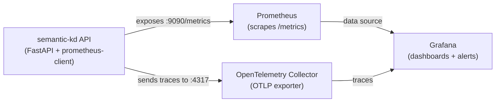

# Monitoring and Alerting

This document covers the observability stack for the semantic-kd service: Prometheus metrics, Grafana dashboards, OpenTelemetry tracing, and alert configuration.

---

## Architecture Overview



---

## Prometheus Metrics

The service exposes Prometheus metrics via the `prometheus-client` library. Metrics are available at the `/metrics` endpoint on port 9090 (configured in `service.yaml` under `monitoring.prometheus`).

### Exposed Metrics

| Metric Name | Type | Labels | Description |
|-------------|------|--------|-------------|
| `semantic_kd_requests_total` | Counter | `method`, `path`, `status_code` | Total HTTP requests handled |
| `semantic_kd_request_duration_seconds` | Histogram | `method`, `path` | Request duration (includes all processing) |
| `semantic_kd_encode_latency_seconds` | Histogram | `model` | Time to encode query text to embeddings |
| `semantic_kd_search_latency_seconds` | Histogram | `index_type` | Time for FAISS nearest-neighbor search |
| `semantic_kd_rerank_latency_seconds` | Histogram | `model` | Time for cross-encoder reranking |
| `semantic_kd_rate_limit_hits_total` | Counter | `client_ip_hash` | Number of rate-limited requests |
| `semantic_kd_model_load_seconds` | Gauge | `model_name` | Time taken to load each model |
| `semantic_kd_index_size` | Gauge | `index_version` | Number of vectors in the FAISS index |
| `semantic_kd_active_connections` | Gauge | - | Current number of active connections |
| `semantic_kd_memory_usage_bytes` | Gauge | `component` | Memory usage by component (model, index, runtime) |
| `semantic_kd_rerank_trigger_total` | Counter | `reason` | Count of reranking triggers (low_confidence, high_importance) |

### Histogram Buckets

Request duration and latency histograms use the following bucket boundaries (in seconds):

```
[0.005, 0.01, 0.025, 0.05, 0.1, 0.25, 0.5, 1.0, 2.5, 5.0, 10.0]
```

---

## Key Metrics to Monitor

### 1. Request Latency (p50, p95, p99)

**What to watch:** `semantic_kd_request_duration_seconds`

**PromQL queries:**

```promql
# p50 latency
histogram_quantile(0.50, rate(semantic_kd_request_duration_seconds_bucket[5m]))

# p95 latency
histogram_quantile(0.95, rate(semantic_kd_request_duration_seconds_bucket[5m]))

# p99 latency
histogram_quantile(0.99, rate(semantic_kd_request_duration_seconds_bucket[5m]))
```

**Healthy range:** p50 < 50ms, p95 < 200ms, p99 < 500ms (without reranking). With reranking enabled, expect p95 < 1s.

### 2. Error Rate by Status Code

**What to watch:** `semantic_kd_requests_total`

**PromQL queries:**

```promql
# Error rate (4xx + 5xx)
sum(rate(semantic_kd_requests_total{status_code=~"[45].."}[5m]))
  /
sum(rate(semantic_kd_requests_total[5m]))

# 5xx rate specifically
sum(rate(semantic_kd_requests_total{status_code=~"5.."}[5m]))
  /
sum(rate(semantic_kd_requests_total[5m]))
```

**Healthy range:** Error rate < 1%. Any 5xx errors warrant investigation.

### 3. Rate Limit Hits

**What to watch:** `semantic_kd_rate_limit_hits_total`

**PromQL query:**

```promql
sum(rate(semantic_kd_rate_limit_hits_total[5m])) by (client_ip_hash)
```

**Healthy range:** Occasional hits are normal. Sustained rate limiting of many clients suggests the limit (100 req/min, burst 20) is too low for your traffic pattern.

### 4. Model Inference Time

**What to watch:** `semantic_kd_encode_latency_seconds` and `semantic_kd_rerank_latency_seconds`

**PromQL queries:**

```promql
# Encoding p95
histogram_quantile(0.95, rate(semantic_kd_encode_latency_seconds_bucket[5m]))

# Reranking p95
histogram_quantile(0.95, rate(semantic_kd_rerank_latency_seconds_bucket[5m]))
```

**Healthy range:** Encoding (ONNX INT8) p95 < 20ms. Reranking (cross-encoder) p95 < 3s. If reranking exceeds `rerank.timeout_ms` (5000ms), it is circuit-broken.

### 5. Memory Usage

**What to watch:** `semantic_kd_memory_usage_bytes` and container-level memory metrics.

**PromQL query:**

```promql
semantic_kd_memory_usage_bytes{component="total"}
```

**Healthy range:** Should stay well below the configured `memory: 32Gi` limit. Alert at 80% utilization.

---

## Suggested Alert Thresholds

| Alert Name | Condition | Severity | For |
|------------|-----------|----------|-----|
| HighLatency | p95 request duration > 1s | warning | 5m |
| CriticalLatency | p99 request duration > 5s | critical | 2m |
| HighErrorRate | 5xx rate > 1% | warning | 5m |
| CriticalErrorRate | 5xx rate > 5% | critical | 2m |
| HighRateLimiting | Rate limit hits > 50/min | warning | 10m |
| MemoryPressure | Memory usage > 80% of limit | warning | 5m |
| MemoryCritical | Memory usage > 95% of limit | critical | 1m |
| ServiceDown | `/live` probe fails | critical | 30s |
| ServiceNotReady | `/ready` probe fails for > 5 minutes after startup | critical | 5m |
| RerankTimeout | Rerank circuit breaker triggered > 10/min | warning | 5m |
| SlowEncoding | Encoding p95 > 100ms | warning | 10m |

### Example Prometheus Alerting Rules

```yaml
groups:
  - name: semantic-kd
    rules:
      - alert: HighLatency
        expr: histogram_quantile(0.95, rate(semantic_kd_request_duration_seconds_bucket[5m])) > 1
        for: 5m
        labels:
          severity: warning
        annotations:
          summary: "High p95 latency on semantic-kd"
          description: "p95 latency is {{ $value | humanizeDuration }} (threshold: 1s)"

      - alert: HighErrorRate
        expr: |
          sum(rate(semantic_kd_requests_total{status_code=~"5.."}[5m]))
          / sum(rate(semantic_kd_requests_total[5m])) > 0.01
        for: 5m
        labels:
          severity: warning
        annotations:
          summary: "High 5xx error rate on semantic-kd"
          description: "5xx error rate is {{ $value | humanizePercentage }}"

      - alert: MemoryPressure
        expr: semantic_kd_memory_usage_bytes{component="total"} / (32 * 1024 * 1024 * 1024) > 0.80
        for: 5m
        labels:
          severity: warning
        annotations:
          summary: "Memory usage above 80% on semantic-kd"
```

---

## OpenTelemetry Configuration

The service uses OpenTelemetry for distributed tracing, configured in `service.yaml` under `monitoring.opentelemetry`.

### Current Configuration

```yaml
opentelemetry:
  enabled: true
  exporter: "otlp"
  endpoint: "http://localhost:4317"
  service_name: "semantic-kd"
```

### Instrumented Spans

The `opentelemetry-instrumentation-fastapi` package auto-instruments all FastAPI routes. Additional manual spans cover:

- `encode_query`: ONNX model inference
- `faiss_search`: FAISS nearest-neighbor lookup
- `rerank`: Cross-encoder reranking pass
- `load_model`: Model loading during startup
- `load_index`: FAISS index loading during startup

### Environment Variable Overrides

```bash
OTEL_EXPORTER_OTLP_ENDPOINT=http://collector:4317
OTEL_SERVICE_NAME=semantic-kd
OTEL_TRACES_SAMPLER=parentbased_traceidratio
OTEL_TRACES_SAMPLER_ARG=0.1  # Sample 10% of traces in production
```

---

## Grafana Dashboard Setup

### Prerequisites

Start the monitoring stack using Docker Compose:

```bash
docker-compose --profile monitoring up -d
```

This starts three services:
- **api** on port 8080 (the semantic-kd service)
- **prometheus** on port 9090 (metrics collection, image `prom/prometheus:v2.47.0`)
- **grafana** on port 3000 (visualization, image `grafana/grafana:10.1.0`)

### Initial Grafana Configuration

1. Open Grafana at `http://localhost:3000`
2. Log in with the credentials set via environment variables:
   - Username: `GRAFANA_ADMIN_USER` (default: `admin`)
   - Password: `GRAFANA_ADMIN_PASSWORD` (must be set in `.env`)
3. Grafana provisioning files are mounted from `./infra/grafana/provisioning/`

### Adding Prometheus as a Data Source

If not auto-provisioned, add manually:

1. Go to Configuration > Data Sources > Add data source
2. Select Prometheus
3. Set URL to `http://prometheus:9090` (using Docker network name)
4. Click Save & Test

### Recommended Dashboard Panels

**Row 1: Request Overview**
- Request rate (requests/sec) by status code
- p50 / p95 / p99 latency time series
- Error rate percentage

**Row 2: Search Pipeline**
- Encoding latency histogram
- FAISS search latency histogram
- Reranking latency histogram
- Rerank trigger rate by reason

**Row 3: Infrastructure**
- Memory usage by component (model, index, runtime)
- Active connections gauge
- Rate limit hits per client

**Row 4: Health**
- Readiness status (up/down timeline)
- Model load time
- Index size (vector count)

---

## Docker Compose Monitoring Stack

The full monitoring stack is defined in `docker-compose.yml`. Key details:

### Prometheus

- Image: `prom/prometheus:v2.47.0`
- Port: 9090
- Config: `./infra/prometheus.yml` (mounted read-only)
- Storage: `prometheus_data` named volume
- Flags: `--web.enable-lifecycle` for hot-reloading config
- Profile: `monitoring` (opt-in, not started by default)

### Grafana

- Image: `grafana/grafana:10.1.0`
- Port: 3000
- Provisioning: `./infra/grafana/provisioning/` (mounted read-only)
- Storage: `grafana_data` named volume
- Sign-up disabled (`GF_USERS_ALLOW_SIGN_UP=false`)
- Depends on: prometheus
- Profile: `monitoring` (opt-in)

### Starting the Stack

```bash
# API only (default)
docker-compose up -d

# API + full monitoring stack
docker-compose --profile monitoring up -d

# View logs
docker-compose logs -f api prometheus grafana
```

---

## Logging Configuration

The service uses `loguru` for structured logging, configured in `service.yaml` under `monitoring.logging`.

### Privacy Controls

```yaml
logging:
  log_queries: false       # Raw query text is NOT logged (privacy)
  log_query_hashes: true   # SHA256 hash prefix for correlation
  log_doc_ids: true        # Document IDs in results are logged
  log_latencies: true      # Per-request latency in milliseconds
```

### Log Format

The `RequestLoggingMiddleware` produces structured log entries:

```
INFO | Request completed | method=GET path=/search client=10.0.0.1 status_code=200 latency_ms=45.23
WARN | Request error     | method=POST path=/search client=10.0.0.2 status_code=429 latency_ms=1.05
ERROR| Request failed    | method=POST path=/search client=10.0.0.3 status_code=500 latency_ms=102.44
```

### Log Levels by Status Code

| Status Code Range | Log Level |
|-------------------|-----------|
| 2xx               | INFO      |
| 4xx               | WARNING   |
| 5xx               | ERROR     |

Configure the base log level via `service.log_level` in `service.yaml` or the `SEMANTIC_KD_SERVICE__LOG_LEVEL` environment variable.
