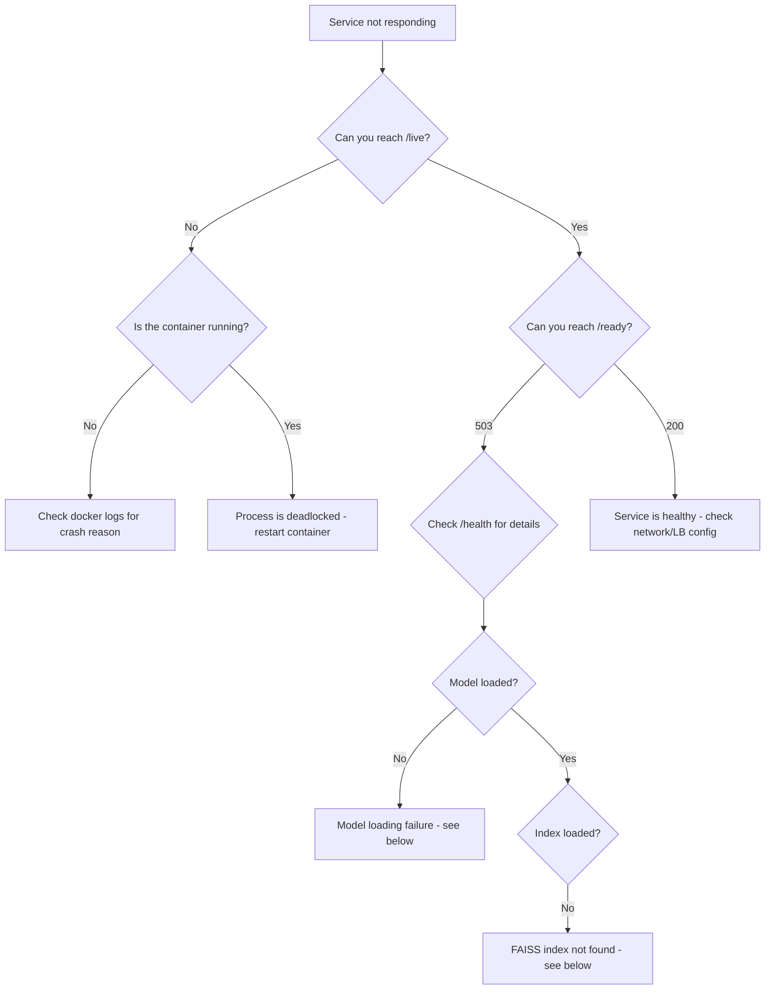
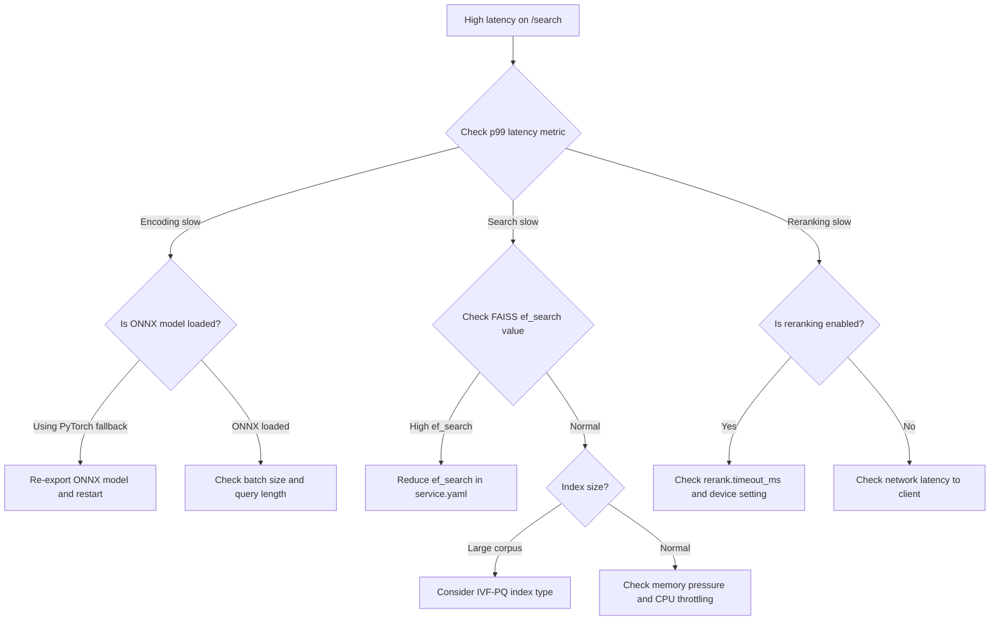
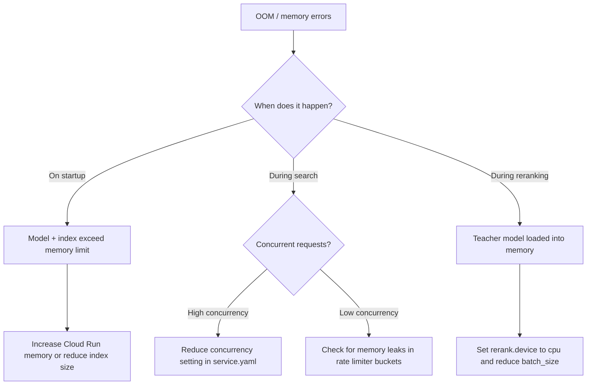

# Runbook: Troubleshooting Guide

This runbook covers the most common failure modes for the semantic-kd service. Each entry follows a consistent format: symptom, likely cause, explanation, and fix.

---

## Quick Reference: Health Endpoints

| Endpoint  | Purpose                              | Healthy Response         |
|-----------|--------------------------------------|--------------------------|
| `/health` | Overall service health               | `200 OK` with status JSON |
| `/ready`  | Readiness probe (model + index loaded) | `200` when ready, `503` when not |
| `/live`   | Liveness probe (process is alive)    | `200` always (unless deadlocked) |

**Interpreting health check responses:**

- `/health` returns a JSON body with component statuses (model, index, memory). If any component reports `degraded` or `unhealthy`, the response includes details about which subsystem failed.
- `/ready` returns `503 Service Unavailable` until the ONNX model and FAISS index are fully loaded. This is expected during startup (configured `startup_probe_delay: 10s` in `service.yaml`).
- `/live` returns `200` as long as the process event loop is responsive. A `503` here indicates the process is deadlocked or frozen.

---

## Decision Trees

### Flowchart: Service Not Responding



### Flowchart: High Latency on /search



### Flowchart: OOM Errors



---

## Symptoms and Fixes

### 1. Service Returns 503 on Startup

**Symptom:** After deployment, all requests return `503 Service Unavailable`. The `/ready` endpoint also returns `503`.

**Likely cause:** The model or index has not finished loading yet, or loading failed entirely.

**Why this happens:** The service loads the ONNX student model and FAISS index into memory during startup. With `load_on_startup: true` in `service.yaml`, this happens before the readiness probe passes. The configured `start_period: 60s` in Docker gives the service time to load, but large models or slow disk I/O can exceed this window.

**How to fix:**

1. Check logs for loading progress:
   ```bash
   docker logs semantic-kd-api 2>&1 | grep -i "loading\|error\|model\|index"
   ```
2. If loading is still in progress, wait for `startup_probe_delay` (default 10s) plus model load time.
3. If loading failed, check for `MODEL_LOAD_ERROR` or `INDEX_NOT_FOUND` errors in logs and follow the relevant sections below.
4. For Cloud Run, increase the startup probe timeout:
   ```yaml
   health:
     startup_probe_delay: 30  # increase from 10
   ```

---

### 2. High Latency on /search

**Symptom:** Search requests take significantly longer than expected (e.g., p95 > 500ms for a simple query).

**Likely cause:** Reranking is triggering on most queries, FAISS ef_search is set too high, or the service is under memory pressure causing CPU throttling.

**Why this happens:** The search pipeline has multiple stages: encoding (ONNX inference), FAISS retrieval, and optional reranking with the teacher cross-encoder. Reranking is the most expensive step. The `confidence_threshold: 0.6` in `service.yaml` controls when reranking kicks in. If most queries produce low-confidence results, reranking runs on nearly every request.

**How to fix:**

1. Check which stage is slow using the Prometheus metrics (see monitoring docs):
   ```
   semantic_kd_encode_latency_seconds
   semantic_kd_search_latency_seconds
   semantic_kd_rerank_latency_seconds
   ```
2. If reranking dominates latency:
   - Raise `rerank.confidence_threshold` to trigger reranking less often
   - Reduce `rerank.batch_size` from 10 to 5
   - Set `rerank.device: cpu` if GPU memory is a concern
3. If FAISS search is slow:
   - Lower `search.ef_search` from 64 to 32 (trades recall for speed)
4. If encoding is slow, verify the ONNX INT8 model is loaded (not the full PyTorch model).

---

### 3. OOM (Out of Memory) Errors

**Symptom:** Container is killed by the OOM killer, or logs show `MemoryError` / `Killed` signals.

**Likely cause:** The combined memory of the ONNX model, FAISS index, and runtime overhead exceeds the container memory limit.

**Why this happens:** Memory budget for the service:
- ONNX INT8 student model: ~100-200 MB
- FAISS HNSW index: ~4 bytes per dimension per vector, plus graph overhead (~1.5x raw vectors)
- Teacher model (if reranking enabled): ~1.3 GB for bge-reranker-large
- Python runtime overhead: ~200-500 MB

With `memory: 32Gi` configured in `service.yaml` for Cloud Run, this should be sufficient for most corpus sizes. OOM typically happens when the index is larger than expected or concurrency is too high.

**How to fix:**

1. Check current memory usage:
   ```bash
   docker stats semantic-kd-api
   ```
2. Reduce memory usage:
   - Disable on-demand teacher loading if reranking is not needed: `features.enable_rerank: false`
   - Reduce `rate_limit.max_buckets` (default 10000) if many unique clients create bucket overhead
   - Lower `gcp.concurrency` from 80 to reduce per-request memory peaks
3. Increase memory allocation if the corpus requires it:
   ```yaml
   gcp:
     memory: "64Gi"
   ```

---

### 4. Rate Limit Errors (429)

**Symptom:** Clients receive `HTTP 429 Too Many Requests` with a `RATE_LIMIT_EXCEEDED` error body and `Retry-After` header.

**Likely cause:** A client exceeded the configured rate limit of 100 requests per minute with a burst allowance of 20.

**Why this happens:** The service uses a token bucket algorithm per client IP (identified by `X-Forwarded-For` header or direct client IP). Each client gets a bucket with capacity equal to `burst` (20 tokens) that refills at `requests_per_minute / 60` tokens per second (~1.67/s). The `/health`, `/metrics`, and `/` paths are excluded from rate limiting.

**How to fix:**

1. If the rate limit is too aggressive for legitimate traffic, increase limits in `service.yaml`:
   ```yaml
   rate_limit:
     requests_per_minute: 200
     burst: 40
   ```
2. If a single client is abusing the API, the rate limiter isolates them by IP without affecting other clients.
3. Check the `Retry-After` header value in the 429 response to understand how long the client should wait.
4. If running behind a load balancer, confirm `X-Forwarded-For` is set correctly. Without it, all clients behind a shared proxy appear as one IP and share a single bucket.

---

### 5. Model Loading Failures

**Symptom:** Logs show `MODEL_LOAD_ERROR` or `ModelLoadError`. The `/ready` endpoint never becomes healthy.

**Likely cause:** The ONNX model file is missing, corrupted, or incompatible with the installed ONNX Runtime version.

**Why this happens:** The service expects the student ONNX model at the path specified by `models.student_onnx_path` in `service.yaml` (default: `./artifacts/models/semantic-kd-student-v1/student_int8.onnx`). This file must be generated by the `make export-onnx && make quantize` pipeline steps.

**How to fix:**

1. Verify the model file exists:
   ```bash
   ls -la artifacts/models/semantic-kd-student-v1/student_int8.onnx
   ```
2. If the file is missing, re-run the export pipeline:
   ```bash
   make export-onnx
   make quantize
   ```
3. If the file exists but loading fails, check ONNX Runtime compatibility:
   ```bash
   poetry run python -c "import onnxruntime; print(onnxruntime.__version__)"
   ```
4. In Docker, confirm the volume mount is correct:
   ```yaml
   volumes:
     - ./artifacts/models:/app/artifacts/models:ro
   ```

---

### 6. FAISS Index Not Found

**Symptom:** Logs show `INDEX_NOT_FOUND` with the expected index path. Search requests return 500 errors.

**Likely cause:** The FAISS index files are missing or the `index_version` in `service.yaml` does not match the directory name under `artifacts/indexes/`.

**Why this happens:** The service looks for three files based on the index configuration:
- `index.faiss` (the FAISS index itself)
- `ids.bin` (document ID mapping)
- `meta.parquet` (document metadata)

These are located at `artifacts/indexes/{index_version}/`. The `index_version` can be overridden via the `INDEX_VERSION` environment variable.

**How to fix:**

1. Verify the index directory exists and contains all three files:
   ```bash
   ls -la artifacts/indexes/20251020-1430_a3f2b1c/
   ```
2. If the index needs to be rebuilt:
   ```bash
   make embed
   make index-build
   ```
3. Update `service.yaml` or set the environment variable to point to the correct version:
   ```bash
   export INDEX_VERSION="20251020-1430_a3f2b1c"
   ```
4. In Docker, ensure the indexes volume is mounted:
   ```yaml
   volumes:
     - ./artifacts/indexes:/app/artifacts/indexes:ro
   ```

---

### 7. Low nDCG After Retraining

**Symptom:** After retraining the student model, offline evaluation metrics (nDCG@10, MRR) are lower than the previous version.

**Likely cause:** Training data quality degraded, negative mining stages were skipped, or hyperparameters regressed.

**Why this happens:** The knowledge distillation pipeline depends on high-quality negatives mined in three progressive stages (BM25 negatives, teacher-scored negatives, ANCE self-mined negatives). Skipping stages or using stale negatives from a previous run can reduce model quality. Additionally, the teacher model (`BAAI/bge-reranker-large`) version matters for score consistency.

**How to fix:**

1. Compare training configs between the good and bad runs:
   ```bash
   diff configs/kd_previous.yaml configs/kd.yaml
   ```
2. Verify all mining stages completed successfully:
   ```bash
   make mine-stage1
   make mine-stage2
   make mine-stage3
   ```
3. Re-run offline evaluation against the BEIR benchmark:
   ```bash
   make eval-offline
   ```
4. Check the training loss curves for signs of overfitting (loss decreasing on train but not on validation).
5. Ensure the teacher model version has not changed unexpectedly.

---

### 8. Docker Container Crashes on Boot

**Symptom:** The container starts and immediately exits with a non-zero exit code. `docker ps` shows the container in a restart loop.

**Likely cause:** Missing environment variables, port conflicts, or insufficient memory for initial model loading.

**Why this happens:** The service reads configuration from `service.yaml` with environment variable overrides (using the `SEMANTIC_KD_SERVICE__*` prefix). Missing required config or a port already in use on the host causes an immediate crash. Memory issues during model loading can trigger the OOM killer before any health check runs.

**How to fix:**

1. Check the container exit code and logs:
   ```bash
   docker logs semantic-kd-api
   docker inspect semantic-kd-api --format='{{.State.ExitCode}}'
   ```
2. Common exit codes:
   - **Exit 1:** Application error (check logs for Python traceback)
   - **Exit 137:** OOM killed (increase memory limit)
   - **Exit 139:** Segfault (usually FAISS or ONNX native library issue)
3. Verify no port conflicts:
   ```bash
   lsof -i :8080
   ```
4. Ensure all required volume mounts exist:
   ```bash
   ls artifacts/models/ artifacts/indexes/
   ```
5. Try running with minimal config to isolate the issue:
   ```bash
   docker run --rm -it semantic-kd:latest python -c "from src.serve.app import app; print('OK')"
   ```

---

## Log Patterns to Watch

These log patterns indicate issues that may not yet cause failures but warrant attention:

| Pattern | Meaning | Action |
|---------|---------|--------|
| `Rate limit exceeded for` | Client hitting rate limits | Check if limits are too low or if abuse is occurring |
| `Cleaned up N stale rate limit buckets` | Normal maintenance (every 5 min) | No action needed unless N is very large (>1000) |
| `Invalid API key from` | Failed authentication attempt | Monitor for brute-force patterns |
| `MODEL_LOAD_ERROR` | Model failed to load | Immediate investigation needed |
| `INDEX_NOT_FOUND` | Index file missing | Check volume mounts and file paths |
| `SEARCH_TIMEOUT` | Search exceeded timeout | Check FAISS performance and reranking config |
| `Request failed` (status >= 500) | Internal server error | Check full stack trace in logs |
| `ENCODING_ERROR` | Text encoding failed | Check input text for invalid characters |
| `Early stopping triggered` | Training stopped early | Review if patience setting is appropriate |

---

## Escalation Path

1. **Check this runbook first** for the matching symptom.
2. **Check Grafana dashboards** (see [monitoring-and-alerting.md](monitoring-and-alerting.md)) for metric anomalies.
3. **Review recent deployments** for configuration or model changes.
4. **Check Cloud Run logs** in GCP Console for infrastructure-level issues.
5. **File an issue** with: logs, metrics screenshots, config diff, and steps to reproduce.
